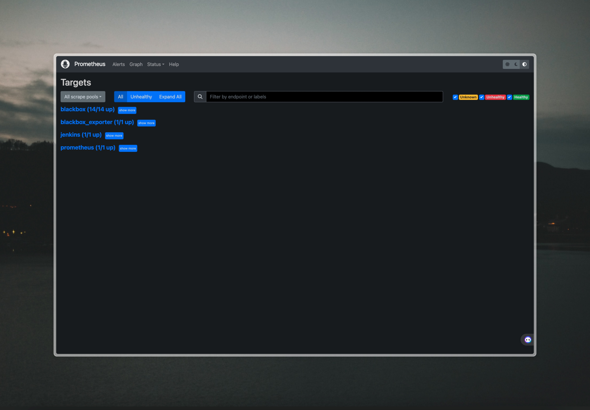
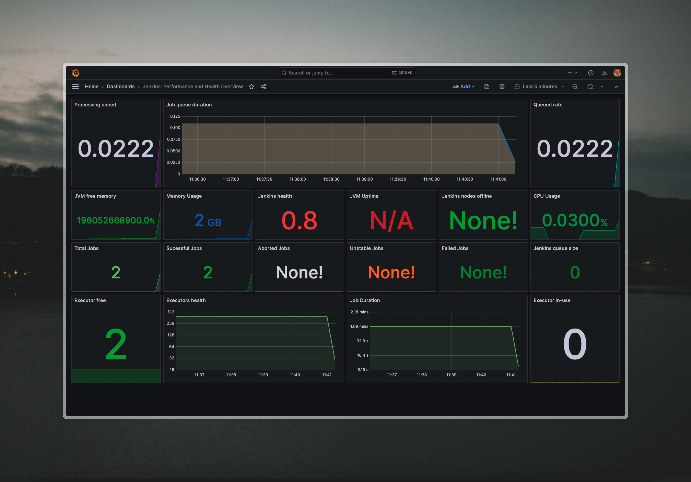

# Bytepipes


## Tools

- `Grafana`
- `Jenkins`
- `Prometheus - BlackBox Exporter`
- `Prometheus - Node Exporter`


## Setting up work environment

- Setting up environment using `docker compose`
```bash
docker compose -f docker-compose.monitoring.yml up -d
```  

## Prometheus Monitoring



## Jenkins Performance and Health Dashboard



### Author

[Siddhant Prateek Mahanayak](https://github.com/siddhantprateek)